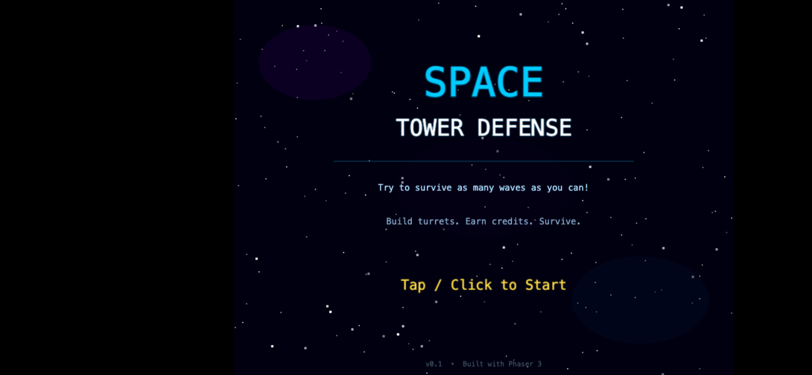
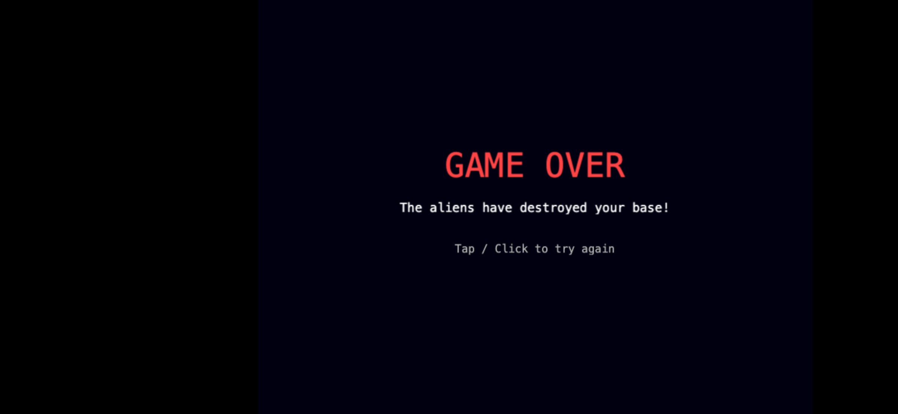

# Space Tower Defense

A browser-based tower defense game built with Phaser 3. Defend your space base by building turrets to stop waves of alien invaders!

**Play it now: [https://liams-projects.vercel.app](https://liams-projects.vercel.app)**





## How to Play

1. **Place turrets** by clicking a weapon button, then clicking on the map
2. **Earn credits** by destroying enemies
3. **Upgrade turrets** by clicking on placed turrets
4. **Survive** as many waves as you can — each wave gets harder!

Your base has 3 HP. If 3 enemies reach the base, it's game over.

## Weapons

| Turret | Cost | Description |
|--------|------|-------------|
| Laser | 50cr | Fast-firing beam, long range |
| M.Gun | 75cr | Rapid fire, short range |
| Missile | 200cr | Slow homing missiles with splash damage |
| Force Field | 75cr | Slows enemies in range (no damage) |
| Bomb | 100cr | Placed on the path, explodes on contact |
| Plasma | 125cr | Fires green plasma that leaves a burning pool |
| Railgun | 300cr | Piercing beam that hits all enemies in a line + burn trail |
| Plane | 150cr | Air strike that flies across the map |
| Hamster | 1000cr | A very special surprise... |

## Enemies

- **Baby Ships** — fast, low HP, fire at nearby turrets
- **Mothership** — slow, high HP, fires at any turret on the map (spawns after baby ships are cleared)
- **Splitters** — split into mini ships on death (wave 2+)
- **Shield Bearers** — absorb hits with shields (wave 3+)
- **Carriers** — release baby ships at half HP (wave 4+)
- **EMP Frigates** — stun turrets temporarily (wave 5+)
- **Boss** — massive mothership every 10th wave

## Leaderboard

After each game, enter your name to submit your score to the global leaderboard. Scores are ranked by wave reached, with faster times breaking ties. View the leaderboard from the title screen.

Cheat mode games are excluded from the leaderboard.

## Admin Mode

Password-protected admin mode for managing leaderboard entries. Access it from the "Admin" button on the title screen. Allows deleting individual entries.

## Environment Variables

The leaderboard and admin features require the following environment variables (set in your Vercel project settings or in a local `.env.local` file):

| Variable | Required | Description |
|----------|----------|-------------|
| `REDIS_URL` | Yes | Redis connection string (e.g. `redis://...` or `rediss://...` for TLS) |
| `ADMIN_PASSWORD` | Yes | Password for the admin panel to manage leaderboard entries |

When setting these on Vercel, make sure the **Preview** checkbox is enabled if you want them available on preview/branch deployments.

## Running Locally

Requires a local HTTP server (ES modules don't work over `file://`):

```bash
cd space-tower-defense
python3 -m http.server 8080
```

Then open `http://localhost:8080` in your browser.

To run with the leaderboard API locally, use `vercel dev` instead (requires the Vercel CLI and a `.env.local` file with the variables above).

## Tech Stack

- **Phaser 3.60.0** via CDN
- **ES Modules** — no bundler, pure browser native modules
- All graphics are procedural (no sprite assets needed)
- Scales to fit any screen size (desktop + mobile)

## Authors

- **Liam Roberts** — Game design and development
- **Claude** (Anthropic) — Co-developer
